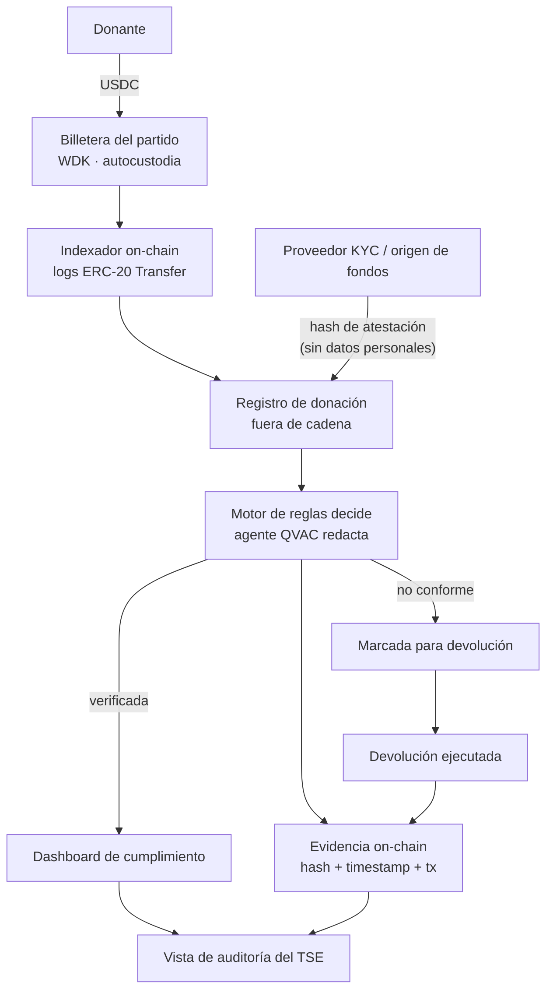

<div align="center">

# Velar Audit

**Auditoría de donaciones para financiamiento político**

Cada donación es trazable desde que llega hasta que se verifica, se marca o se devuelve.
La evidencia queda en cadena. La identidad del donante nunca sale del proveedor de KYC.

<br>


**Aleph Hackathon 2026** · Tracks **WDK** + **QVAC** de Tether

</div>

---

## El problema

El Tribunal Supremo de Elecciones de Costa Rica supervisa el financiamiento de los partidos
políticos, pero lo hace sobre papel. Nadie puede verificar de forma independiente quién dio
qué, cuándo, ni si el dinero era legal — y los controles que sí existen ocurren meses después
de la elección.

El presidente y los magistrados del TSE nos pidieron construir esto.

La restricción que define todo el diseño: **la identidad del donante es información sensible y
protegida, pero el hecho de la donación y su estado de cumplimiento deben ser verificables
públicamente.** Por eso los datos sensibles se quedan fuera de la cadena, con el proveedor que
los recolectó, y a la cadena solo van hashes.

---

## Correlo en 4 comandos

Requiere Node 22+. Nada más — sin base de datos, sin llaves, sin fondos de testnet.

```bash
git clone https://github.com/Velar-Bonds/Velar-Audit.git
cd Velar-Audit
npm install && cp .env.example .env
npm start
```

Abrí <http://localhost:3400>. La pantalla de login trae botones para entrar con cualquiera
de las tres cuentas de demo (contraseña `velar-demo-2026`):

| Cuenta | Rol | Ve |
|---|---|---|
| `tse@velar.cr` | TSE | Las 4 donaciones, de los dos partidos |
| `alfa@velar.cr` | Partido Alfa | Sus 3 donaciones |
| `beta@velar.cr` | Partido Beta | Su 1 donación |

Entrá como TSE y presioná **Recargar escenario de demo**.

Vas a ver cuatro donaciones que cubren todos los resultados posibles: una limpia, una esperando
su atestación, una de un donante extranjero y una sobre el tope anual. Presioná **Devolver** en
una no conforme y se ejecuta la devolución con su evidencia anclada.

> `DEMO_MODE=1` viene por defecto: la cadena está simulada y el cumplimiento corre con el motor
> de reglas determinista. El pipeline, el modelo de datos y el dashboard son **idénticos** al
> modo real.

---

## Cómo funciona



### Las cuatro etapas

| | Etapa | Qué pasa |
|---|---|---|
| **1** | **Ingreso** | Una billetera autocustodial construida con WDK recibe las donaciones. Un indexador lee los logs `Transfer` directo de la cadena, así que **una donación no puede llegar sin quedar registrada**. El partido no se autorreporta. |
| **2** | **Evidencia** | El proveedor de KYC emite una atestación. Guardamos una referencia seudónima del donante y el SHA-256 del contenido. **El contenido —el nombre, la cédula, el rastro bancario— nunca entra al sistema.** |
| **3** | **Cumplimiento** | Un motor de reglas determinista evalúa cada donación contra la ley costarricense y decide el estado. Un agente QVAC corre un modelo de lenguaje **en la máquina** para convertir ese resultado en una frase que un auditor pueda leer. Correr local no es una decisión de rendimiento: una API en la nube le entregaría a un tercero la lista de donantes de todos los partidos del país. |
| **4** | **Ejecución** | Las donaciones no conformes se marcan para devolución. Se ejecuta el reembolso y toda la cadena de eventos queda anclada con hash, timestamp y referencia de transacción. |

---

## Quién ve qué

| | TSE | Partido |
|---|---|---|
| Ver donaciones | Todos los partidos | Solo las propias |
| Devolver / re-evaluar | Cualquiera | Solo las propias |
| Bitácora completa de evidencia | Sí | No |
| Recargar el escenario | Sí | No |

El aislamiento entre partidos **no es un filtro en la lista**. Cada acción sobre una donación
verifica la propiedad, y un partido que pide una donación ajena por id recibe **404, no 403** —
porque saber que esa donación existe ya es información a la que no tiene derecho.

Las contraseñas se guardan con `scrypt` y sal por usuario; los tokens de sesión se guardan
hasheados, así que una base robada no entrega sesiones vivas. El login responde en tiempo
constante exista o no la cuenta, para que el formulario no sirva para averiguar quién trabaja en
el TSE, y corta a los 8 intentos fallidos por correo.

---

## Dos decisiones de diseño que vale la pena defender

**El modelo redacta, no juzga.** `rules.ts` decide el estado de cumplimiento; `qvac-agent.ts`
corre el modelo local para convertir los códigos de regla en una frase que un auditor pueda leer.
**Nunca se le pregunta si algo es legal**, porque un veredicto con consecuencia legal tiene que
ser reproducible por un regulador y un modelo muestreado no lo es. Y porque lo probamos: ver
[abajo](#por-qué-un-modelo-de-4b-y-no-uno-de-1b).

**La billetera se hace cumplir a sí misma.** El motor de políticas de WDK bloquea la billetera
con una regla `returns-only`: se niega toda transferencia saliente salvo que el destinatario ya
haya donado. Un tesorero que quiera mover fondos donados a donde no corresponde no recibe una
transacción fallida — **nunca llega a obtener una firma**.

---

## Reglas de cumplimiento

| Regla | Severidad | Base |
|---|---|---|
| `foreign_donor` | 🔴 violación | El financiamiento político extranjero es ilegal en CR, CO, BR y AR |
| `kyc_failed` | 🔴 violación | El proveedor no pudo verificar la identidad |
| `undisclosed_source` | 🔴 violación | No se admiten donaciones anónimas |
| `over_cap` | 🔴 violación | El donante superó el tope anual |
| `attestation_tampered` | 🔴 violación | El hash de la atestación no reproduce |
| `no_attestation` | 🟡 → 🔴 | Escala cuando vence el plazo de subsanación |
| `pep_donor` | 🟡 advertencia | Persona expuesta políticamente — revisión manual del TSE |

> ⚠️ La prohibición de financiamiento extranjero es ley real. **El tope numérico en
> `.env.example` es un valor de ejemplo**, no una cifra legal — hay que confirmarlo contra el
> Código Electoral antes de presentarlo al TSE como algo más que una ilustración.

---

## Estado actual — qué sirve y qué no

| | Componente | Estado |
|---|---|---|
| ✅ | Modelo de datos, hashing canónico, formato de anclaje | Funciona, verificado |
| ✅ | Motor de reglas de cumplimiento | Funciona, verificado |
| ✅ | Billetera WDK — derivación de dirección y saldos | **Verificado contra Sepolia en vivo** |
| ✅ | Indexador de logs ERC-20 | Implementado |
| ✅ | Política `returns-only` de WDK | Implementada |
| ✅ | Anclaje de evidencia + ciclo completo | Funciona de punta a punta |
| ✅ | Dashboard (claro y oscuro, sin errores de consola) | Funciona |
| ✅ | **Agente QVAC corriendo localmente** | Verificado: Qwen3 4B evalúa las 4 donaciones en ~4 s cada una |
| 🔷 | Cadena y reembolso en `DEMO_MODE=1` | Simulados, y **marcados como `(sim)`** en la API y la UI |
| 🔷 | Proveedor de KYC | Stub. La frontera es lo que importa; la implementación es un archivo |
| ✅ | **Autenticación y roles (TSE / partido)** | Verificado, incluidos los intentos de escalación |
| ✅ | **Multi-partido con billetera derivada por partido** | Cada partido, su propio índice BIP-44 del mismo seed |
| ❌ | Ciclo de vida de bonos | Fuera de alcance — eso lo cubre la plataforma VELAR |

### Requisito para QVAC en macOS

El addon nativo (`@qvac/llm-llamacpp`) enlaza contra OpenSSL 3 de Homebrew en una ruta absoluta.
Sin eso el worker no arranca y el sistema **cae limpiamente al motor de reglas** — el dashboard
lo indica por fila.

```bash
brew install openssl@3
```

### Por qué un modelo de 4B y no uno de 1B

Probamos `LLAMA_3_2_1B_INST_Q4_0` (773 MB) y **no sirve para esta tarea**. Pedido a reformular un
veredicto ya decidido, invirtió el significado de forma consistente: escribió *"donante extranjero
(US) no rechazada"* para una donación no conforme. También inventó legislación electoral que no
existe.

Por eso el agente incluye una guarda que descarta cualquier razonamiento que contradiga su propio
veredicto, y el default es `QWEN3_4B_INST_Q4_K_M` (~2,4 GB), que produce la frase correcta de
forma estable.

---

## Pasar a modo real

```bash
npm run qvac:pull    # descargá los pesos del modelo ANTES de necesitarlos
npm run wallet:new   # generá la semilla BIP-39 de la billetera del partido
```

Poné la semilla en `.env` como `WDK_SEED_PHRASE`, cambiá `DEMO_MODE=0`, fondeá la dirección con
ETH y USDC de Sepolia, y `npm start`.

`WDK_TOKEN_ADDRESS` es lo único que cambia entre USDC, USDT y mainnet — el camino de código de
WDK es idéntico para cualquier ERC-20.

---

## Stack

| Tecnología | Rol |
|---|---|
| **Tether WDK** | Billetera autocustodial del partido + motor de políticas |
| **Tether QVAC** | Modelo de lenguaje local para el análisis de cumplimiento |
| **TypeScript** + **Node 22** | Todo el backend, corrido con `tsx` — sin paso de build |
| **Express** | API HTTP |
| **Ethereum Sepolia** | Cadena de la demo, vía RPC público |
| **HTML + CSS** | Dashboard en un solo archivo, sin framework ni bundler |

---

## Estructura

```
src/
  types.ts                       modelo de datos canónico
  store.ts                       almacén de auditoría
  pipeline.ts                    ingreso → evidencia → cumplimiento → ejecución
  wallet/wdk.ts                  billetera WDK + política returns-only
  wallet/indexer.ts              indexador de logs ERC-20
  attestation/hash.ts            JSON canónico + SHA-256
  attestation/stub-provider.ts   stand-in de Sumsub / Truora
  compliance/rules.ts            reglas deterministas — la autoridad
  compliance/qvac-agent.ts       modelo local — razonamiento y alertas extra
  evidence/anchor.ts             hash + timestamp + referencia de tx
  auth/passwords.ts              scrypt con sal por usuario
  auth/store.ts                  usuarios y sesiones (archivo aparte)
  auth/middleware.ts             sesión, roles y alcance por partido
  auth/routes.ts                 login / logout / me
  seed.ts                        partidos y cuentas de demo
  server.ts                      API HTTP
  demo.ts                        el escenario de cuatro donaciones
web/index.html                   dashboard
```

## Comandos

| Comando | Qué hace |
|---|---|
| `npm start` | Levanta el servidor |
| `npm run dev` | Igual, con recarga al guardar |
| `npm run typecheck` | `tsc --noEmit` |
| `npm run qvac:pull` | Descarga los pesos del modelo QVAC |
| `npm run wallet:new` | Genera la semilla de la billetera |
| `npm run donate:sim -- 2500 0xdonante…` | Inyecta una donación en un servidor corriendo |

---

<div align="center">

MIT · [LICENSE](LICENSE)

</div>
